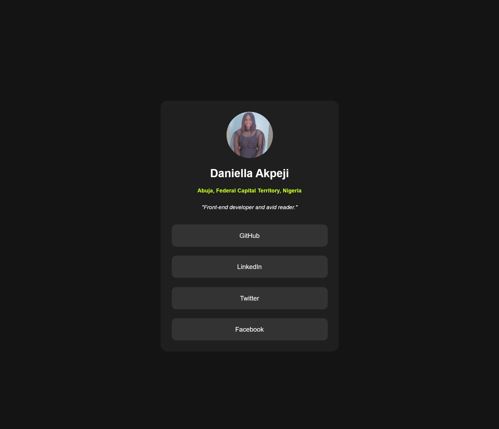

# Frontend Mentor - Social links profile solution

This is a solution to the [Social links profile challenge on Frontend Mentor](https://www.frontendmentor.io/challenges/social-links-profile-UG32l9m6dQ). Frontend Mentor challenges help you improve your coding skills by building realistic projects. 

## Table of contents

- [Overview](#overview)
  - [The challenge](#the-challenge)
  - [Screenshot](#screenshot)
  - [Links](#links)
- [My process](#my-process)
  - [Built with](#built-with)
  - [What I learned](#what-i-learned)
- [Author](#author)
- [Acknowledgments](#acknowledgments)

**Note: Delete this note and update the table of contents based on what sections you keep.**

## Overview

### The challenge

Users should be able to:

- See hover and focus states for all interactive elements on the page

### Screenshot

### Links

- Solution URL: [Here](https://your-solution-url.com)
- Live Site URL: [Here](https://your-live-site-url.com)

## My process

### Built with

- Semantic HTML5 markup
- CSS custom properties
- Flexbox
- Mobile-first workflow

### What I learned

When working with links that navigate to another page, the best practice in semantic HTML is to use anchor (<a>) tags and style them to look like buttons. However, when submitting a form or triggering an action, buttons (<button>) should be used instead.

Also, inline elements do not support width, height, or vertical margins. I tried applying width, height, and margin to my <a> tags to space them out, but it didn’t work. So, I changed their display to block and set the width to 100%, which solved the spacing issue.

## Author

- Frontend Mentor - [@Apejidaniella](https://www.frontendmentor.io/profile/Apejidaniella)
- Twitter - [@D71411Apeji](https://x.com/D71411Apeji)

## Acknowledgments

My profound appreciation and gratitude goes to my mentor Daniel Enagu, for his patience, holding me by the hand helping make corrections, guide and show me better ways to write my codes. 

